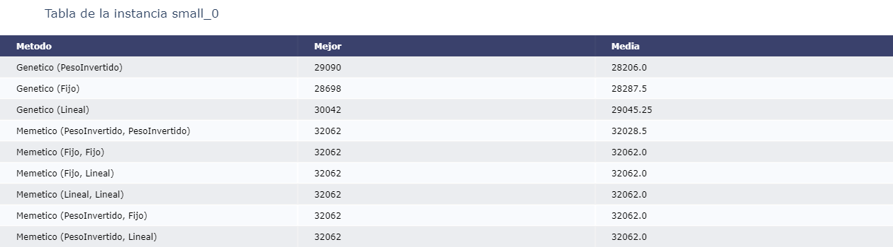

# Introducción

El problema de mochila 0-1 es bastante conocido. Se tiene un conjunto de $N$ objetos $S$, cada objeto tiene un peso $p_i$ y un valor $v_i$. El problema nos pide elegir un subconjunto de esos objetos $S' \subset S$ que maximice la suma de los valores de los objetos pero que la suma de pesos no sobrepaso un valor $P$ (peso máximo). Es decir, queremos maximizar la función

$$
F(S') = \left\{
\begin{array}{rcl}
0 & \text{si} & \sum_{(p_i, v_i) \in S'} p_i > P \\
\sum_{(p_i, v_i) \in S'} v_i & \text{si} & \sum_{(p_i, v_i) \in S'} p_i \leq P \\
\end{array}
\right.
$$

En este trabajo discutiremos métodos de cómo lograr maximizar dicha función usando un algoritmo genético.

# Solución exacta

Existe una solución al problema usando programación dinámica. Si llamamos $f(i, p)$ a la función que nos devuelve la respuesta para los primeros $i$ elementos con una mochila de peso $p$, podemos ver que la transición si $p \geq p_i$ consiste de 

$$
    f(i, p) = \max \left( f(i-1, p), f(i-1, p - p_i) + v_i \right).
$$

Es decir, lo mejor entre tomar el último elemento o no tomarlo. En caso de que $p < p_i$ no podemos tomar el último elemento y tenemos que 

$$
    f(i, p) = f(i-1, p).
$$

La solución tiene una complejidad en tiempo de $O(N \times P)$ y en memoria de $O(P)$ lo cual funciona bastante bien en instancias con una $P$ no muy grande. Nuestro objetivo es proporcionar un método que dé resultados prometedores para instancias grandes.

# Instancias

Para probar y comparar las soluciones propuestas es necesario tener cierto conjunto de instancias. En este caso, se generaron instancias de forma aleatoria con un script en Python. Las instancias se dividen por tamaño, tenemos las instancias pequeñas, medianas y grandes. A continuación, tenemos los rangos de los valores generados para cada instancia.

| Tamaño | N | P |
| --- | --- | --- |
| Pequeño | [10, 1000] | [10, 1000] |
| Mediano | [$10^3$, $10^4$] | [$10^5$, $10^6$] |
| Grande | [$10^3$, $10^4$] | [$10^8$, $10^9$] |

El valor de los objetos fue creado en el rango [$1$, $10^3$] y el peso en el rango $[1, P/10]$. Todos los números generados con una distribución uniforme en los enteros. Esto genera que la respuesta se pueda conformar de *por lo menos* $10$ elementos. Se generaron 3 instancias por cada tamaño que tenemos.

| Nombre  | Tamaño  | N | P |
| --- | --- | --- | --- |
| small_0 | Pequeño | 182 | 614 |
| small_1 | Pequeño | 566 | 639 |
| small_2 | Pequeño | 757 | 654 |
| medium_0 | Mediano | 6218 | 525309 |
| medium_1 | Mediano | 4036 | 106453 |
| medium_2 | Mediano | 8989 | 658994 |
| big_0 | Grande | 1895 | 531391634 |
| big_1 | Grande | 2591 | 212411220 |
| big_2 | Grande | 2406 | 710240262 |

# Representación de soluciones

En este caso vamos a representar la solución como un vector de booleanos en donde la posición $i$ indica que llevamos el objeto $i$ o no. Es claro que esta representación tiene la desventaja de contener soluciones que no nos interesan, como lo son aquellas que su peso es mayor al máximo permitido.

| Objeto 1 | Objeto 2 | Objeto 3 | Objeto 4 | Objeto 5 |
| -------- | -------- | -------- | -------- | -------- |
| True     |  False   |  False   | True     | False    |

Este vector representaría una solución donde tomamos únicamente el objeto 1 y 4.

# Penalizaciones

Como se mencionó anteriormente, usaremos un algoritmo genético para obtener soluciones candidatas a las instancias que generamos. Sin embargo, el objetivo de este trabajo es ver cómo funciona el algoritmo genético bajo distintas penalizaciones. La hipótesis que se tiene es que el algoritmo genético no funciona de forma correcta con la función que nos presenta el problema inicial. Se tiene esta intuición ya que entre soluciones con un peso mayor al permitido sucede que la función es $0$; por lo tanto, entre esos candidatos no existe uno que sea "mejor que otro". Entonces, en lugar de poner $0$ aquellos candidatos que se exceden del peso, se hacen propuestas de ciertas penalizaciones que le podemos hacer a la función para que pueda ir llegando a soluciones validas.

## Fija

Sea $restante = P - \sum_{(p_i, v_i) \in S'} p_i$. Una propuesta se basa en modificar la función de aptitud como sigue

$$
F(S') = \left\{
\begin{array}{rcl}
\sum_{(p_i, v_i) \in S'} v_i & \text{si} & restante \geq 0 \\
\sum_{(p_i, v_i) \in S'} v_i + \sigma \cdot restante & \text{si} & restante < 0
\end{array}
\right.
$$

Esta función se basa en ver por cuanto peso me pase del límite ($restante$) y en caso de pasarme del límite, penalizo por $\sigma$ cada unidad de la que me pase. El valor de $\sigma$ puede llevarnos a toda una discusión. Lo que se ha visto es que debe ser un valor suficientemente alto para no quedarnos con soluciones invalidas. La propuesta en este trabajo es tomar $\sigma$ como $\max_{{(p_i, v_i) \in S'}}(v_i / pi) + 1$. Al final la sigma está penalizando las unidades de peso; por lo que tiene sentido que esta penalización debe ser mayor a la razón que existe entre el valor y peso de cada objeto.

## Lineal

Esta penalización se basa en la misma idea que la anterior. La diferencia principal es que el parámetro $\sigma$ varía dependiendo de la generación en la que nos encontremos en el algoritmo. Llamemos $M = \max_{{(p_i, v_i) \in S'}}(v_i / pi) + 1$, es decir, el valor que le asignamos a sigma anteriormente. Lo que haremos es inicializar a $\sigma$ en $1$, luego en cada generación aumentamos en $1$ a sigma hasta llegar a $M + 10$. Una vez llegamos a ese límite reiniciamos a $\sigma$ en $1$.

Esto provoca que la variable aumente de forma lineal conforme pasan las generaciones en el algoritmo. Al inicio la penalización que sufren respuestas invalidas es muy leve; por lo cual, el algoritmo empieza a explorar por esas soluciones. Conforme aumentamos en las iteraciones, la penalización se vuelve más estricta y fuerza al algoritmo a pasar a un estado de explotación en lugar de exploración. Luego de llegar a un límite (en este caso 10 más que en la fija, para que pueda explotar más las soluciones) procedemos hacer un reinicio para que el algoritmo pueda explorar nuevamente.

## Peso Invertido

Llamamos $V(S)$ la suma de los valores en la solución $S$ y $P(S)$ la suma de los pesos. Esta penalización se basa en la selección por aptitud de los individuos en el algoritmo genético. Es decir, si tenemos dos soluciones $S_1$, $S_2$ queremos poder tener la siguiente relación. 

| $P(S_1) \leq P$ | $P(S_2) \leq P$ | Mejor |
| --- | --- | --- |
| No  | No | El que tenga menor $P(S_i)$ |
| Si  | No | $S_1$ |
| No  | Si | $S_2$ |
| Si  | Si | El que tenga mayor $V(S_i)$ |

Para lograr esto, se decidió considerar la siguiente función de aptitud.

$$
F(S') = \left\{
\begin{array}{rcl}
\sum_{(p_i, v_i) \in S'} v_i & \text{si} & restante \geq 0 \\
-P(S') & \text{si} & restante < 0
\end{array}
\right.
$$

Es decir, cuando el peso de la solución se pase del máximo, en lugar de asignarle $0$ a la función de aptitud, procedemos a ponerle menos el peso del objeto. De esta forma conseguimos una relación como la que buscábamos en la tabla.

# Algoritmo Genético

El algoritmo genético consiste en 4 pasos principales que explicaremos como los aplicamos en el problema.

1- Selección
2- Cruza
3- Mutación
4- Elitismo

Además, se prueba un algoritmo memetico que consiste en aplicar una búsqueda local después de la mutación de la población.

## Inicialización

Para iniciar el algoritmo se genera una población $x_{0, i}$ que consiste en soluciones aleatorias. Dentro la solución cada objeto tiene un $50\%$ de probabilidad de ser elegido o no.

## Selección

En este caso se hace una selección por torneo binario. Elegimos dos individuos aleatorios $x_{j_1, i}, x_{j_2, i}$ y nos quedamos con el individuo que tenga mayor aptitud. Esta selección se hace de acuerdo a la función de aptitud penalizada de acuerdo a la penalización que hayamos elegido para la selección.

## Cruza

En este caso usamos una cruza uniforme. Es decir, escogemos dos individuos de la población generada por la selección $y_{j_1, i}, y_{j_2, i}$ y generamos dos nuevos individuos. Por cada elemento iteramos, si el $k$-esimo elemento se encuentra en ambos entonces ese elemento se va a encontrar en los nuevos, mismo caso si no se encuentran. Si el elemento no se encuentra en uno, pero si en el otro existe un $50\%$ de probabilidad de que se encuentre en el primer individuo nuevo y en el otro no; el otro $50\%$ de probabilidad es que suceda lo contrario.

Esta cruza ocurre con una probabilidad $CR$. Si no hay cruza los individuos se mantienen como estan.

## Mutación

En este caso usamos una mutación uniforme. Cada elemento de un individuo tiene probabilidad $10 / N$ de sufrir un cambio; es decir, si el elemento se encuentra en la solución lo quitamos y si no esta lo ponemos. Se eligió esta probabilidad para que de esta forma la esperanza sea cambiar por lo menos 10 elementos de la solución. Esta mutación tiene que ser fuerte debido a que en los algoritmos memeticos nos podemos quedar en un óptimo local.

## Elitismo

Siempre se preserva el mejor individuo en cada generación. Para elegir al mejor individuo se checa con la penalización de `Peso Invertido`; es decir, nos quedamos con el que nos de mayor aptitud. En caso de que todas las soluciones tengan un peso mayor al máximo, entonces se tomara el individuo con menor peso excedente. Si en la nueva generación no se encuentra un individuo que mejore al mejor de la anterior generación, entonces eliminamos al peor e insertamos al mejor de la anterior generación.

## Búsqueda local

Para cierta solución $x$ se define un vecino a distancia $1$ como todas las soluciones que consisten que hacer un cambio en algún elemento de la solución.

La búsqueda local hecha en el caso de los algoritmos memeticos se basa en buscar entre todos los vecinos al mejor hasta que no haya alguno que mejore la solución actual. La función de aptitud usada es la penalización para la búsqueda local; se decidió usar una diferente a la del torneo para darle oportunidad al algoritmo de explorar más.

# Resultados 

Cada algoritmo se corre con $5$ semillas aleatorias distintas durante $1$ horas. A continuación, veremos los resultados que se obtuvieron para cada algoritmo. Los memeticos tienen entre paréntesis las penalizaciones que se usaron, la primera es la del torneo binario y la segunda corresponde a la penalización de la búsqueda local. Las tablas se encuentran ordenadas por la media de los resultados de cada algoritmo.

Podemos ver como el algoritmo genético por sí solo no encuentra los mejores resultados. Esto puede ser causado por las diversas operaciones de exploración que tenemos que son la cruza y la mutación que no permiten construir una solución optima en pocas iteraciones en un problema que es muy sensible a modificaciones. Porque podemos tener una solución con una aptitud bastante buena, pero el hecho de hacer una mutación hace que se pase del peso limite y ahora se vuelva una solución muy mala.

Por otro lado, los algoritmos memeticos arreglan la parte de explotación que le hace falta el algoritmo. Cuando aplicamos una búsqueda local permitimos que los individuos queden (muy posiblemente) en el dominio de soluciones validas.

En cuanto a las instancias pequeñas no conviene mucho fijarnos en ellas ya que por su propia naturaleza el algoritmo llega a una muy buena solución independientemente de la penalización usada. Si fijamos nuestra mirada a las instancias grandes y medianas podemos ver como aquellos algoritmos que usan penalización Fija y Peso Invertido resultan estar en la parte inferior de la tabla. Esto nos indica que el algoritmo funciona mejor cuando la función de aptitud se mantiene fija durante el tiempo, en lugar de cambiar con las iteraciones como lo hace la penalización Lineal. Esto tiene cierto sentido ya que al ir perturbando la función de aptitud el algoritmo genético tiende a perderse en las soluciones que iba construyendo generación con generación.

# Conclusiones

Para este problema hacer un algoritmo genético de forma general puede resultar una tarea complica. Muy probablemente necesitemos de operadores de *selección*, *cruza* o *mutación* muy específicos al problema, lo cual termina desvirtuando el objetivo del algoritmo genético. Sin embargo, al poner un paso de búsqueda local logramos que el algoritmo mejore de forma substancial y ahora la parte del algoritmo genético se dedica a explorar nuevas soluciones mientras que la búsqueda local se encarga de mejorar a los individuos de la población para llegar a un dominio de respuestas validas.

Finalmente, se debe destacar la observación que estos algoritmos funcionan mejor bajo penalización fijas en lugar de penalizaciones dinámicas en los resultados vistos en este trabajo.

Se puede acceder al código de este trabajo mediante Github. [https://github.com/5an7y/Knapsack]( https://github.com/5an7y/Knapsack)

# Referencias

- Segura, C. y Hernandez, A. (2022). Curso de optimización estocástica. Centro de Investigación en Matematicas, Mexico.
- Hidalgo, J. y Turrado, J. (S.F.). Algoritmos geneticos: Aplicación al problema de la mochila. Recuperado de: [https://www.it.uc3m.es/jvillena/irc/practicas/10-11/01mem.pdf](https://www.it.uc3m.es/jvillena/irc/practicas/10-11/01mem.pdf)
